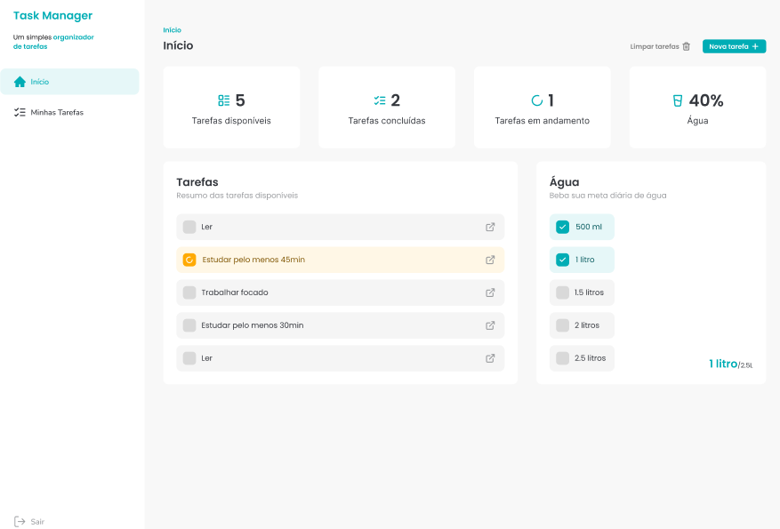
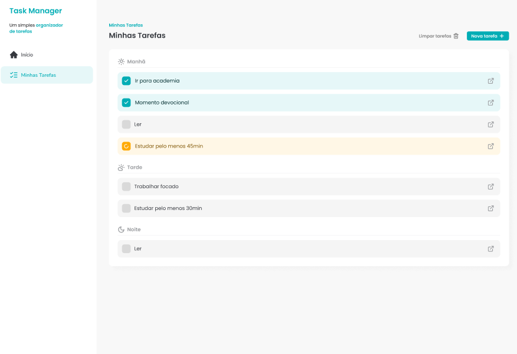

<div align="center">

# ✅ Task Manager

**Um simples e elegante organizador de tarefas desenvolvido com React 19, TailwindCSS 4 e React Query.**


</div>

---

## 🧠  — Visão do Projeto

### ⭐ — *(Situação)*

Eu precisava de uma forma simples e visualmente organizada para administrar minhas tarefas diárias, divididas por períodos do dia. Os aplicativos existentes eram complexos, cheios de anúncios e distrações.

### 🎯  — *Tarefa*

Criar uma aplicação limpa e minimalista que:

- Mostrasse as tarefas separadas em **Manhã, Tarde e Noite**
- Permitisse marcar o progresso de forma visual
- Exibisse um dashboard com resumo das tarefas
- Incluísse uma mini meta diária de **hidratação (consumo de água)**

### ⚙️  — *Ação*

Desenvolvi o app com:

- **React 19 + Vite**
- **TailwindCSS 4** para estilização
- **React Query** para gerenciamento inteligente de dados
- **React Hook Form** para criação/edição de tarefas
- **UUID** para gerar IDs únicos
- **Husky + ESLint + Prettier** para padronização de código

Organizei tudo com arquitetura modular (`components/`, `context/`, `hooks/`).

### 🟢  — *Resultado*

O resultado foi um Task Manager:

- Simples ✅
- Bonito ✅
- Produtivo ✅
- Sem distrações ✅

A produtividade aumentou porque o app mostra apenas o essencial.

---

## 🖥️ Screenshots

### 📌 Tela — *Dashboard (Início)*

> Resumo do dia + meta de água



---

### 📝 Tela — *Minhas Tarefas*

> Separação por períodos do dia + UX minimalista



---

## ✨ Features

| Funcionalidade | Status |
|----------------|--------|
| Adicionar tarefas | ✅ |
| Marcar como concluída | ✅ |
| Separar por períodos (manhã / tarde / noite) | ✅ |
| Dashboard com contadores | ✅ |
| Meta diária de água | ✅ |
| Armazenamento em LocalStorage | ✅ |
| Animações de transição | ✅ |

---

## 🛠️ Tecnologias utilizadas

| Tecnologia | Finalidade |
|------------|------------|
| React 19 | construção de componentes |
| Vite 7.1 | bundler e servidor |
| TailwindCSS 4 | estilização |
| React Query | gerenciamento de dados |
| React Router DOM | navegação |
| React Hook Form | gerenciamento de formulários |
| UUID | gerar IDs para cada tarefa |
| Husky, ESLint & Prettier | padronização de código |

---

## ✅ Instalação e Execução

Clone o projeto:

```sh
git clone https://github.com/SEU_USUARIO/task-manager.git
cd task-manager

▶️ Rodar o projeto

Para iniciar o servidor de desenvolvimento, execute: npm run dev

🏗️ Build de produção

Para gerar o build otimizado: npm run build

🔍 Visualizar o build

Para pré-visualizar o build gerado: npm run preview

src/
 ├─ components/
 ├─ context/
 ├─ hooks/
 ├─ pages/
 ├─ routes/
 ├─ utils/
 └─ main.jsx

| Script            | Função                       |
| ----------------- | ---------------------------- |
| `npm run dev`     | Inicia o servidor            |
| `npm run build`   | Gera o build para produção   |
| `npm run preview` | Pré-visualiza o build        |
| `npm run lint`    | Verifica qualidade de código |
| `npm run prepare` | Configura Husky (pré-commit) |

🎨 Layout & Design System

UI minimalista centrada em baixa carga cognitiva

Paleta de cores suave para foco visual

Componentes reutilizáveis garantindo consistência visual

💡 Roadmap (melhorias futuras)

 Dark mode 🌙

 Exportar tarefas para PDF

 Integração com API (Supabase)

 Notificações sonoras ao concluir tarefa

🤝 Contribuindo

Faça um fork do projeto.

Crie uma nova branch: git checkout -b minha-feature

Realize o commit das alterações: git commit -m "feat: nova funcionalidade"

Envie a branch: git push origin minha-feature

Abra um Pull Request 🚀

📜 Licença

Este projeto está sob a licença MIT — sinta-se livre para usar, modificar e melhorar.

📬 Contato

👤 Seu Nome
🔗 GitHub: https://github.com/ValfranJr

🔗 LinkedIn: 

"Produtividade não é sobre fazer mais, e sim sobre fazer melhor." ✨
